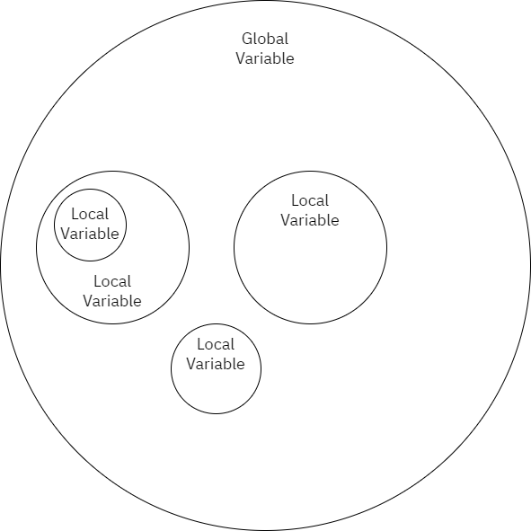

# ตัวแปร คำสั่ง การทดสอบ

## ตัวแปรคืออะไร?

ตัวแปร (Variable) คือค่าที่มีหน้าที่ในการจัดเก็บข้อมูลที่เราต้องการ โดยค่านี้เราสามารถเรียกใช้และเปลี่ยนแปลงได้ ซึ่งเราจะเอาประโยชน์จากความสามารถในการเก็บข้อมูลและคืนค่าข้อมูล มาใช้ในการเขียนภาษาโปรแกรมมิ่งอย่าง Python กัน

### วิธีการเก็บข้อมูลภายในตัวแปร

เพื่อทำการเก็บข้อมูลภายในตัวแปร ให้เราทำการตั้งชื่อค่าตัวแปร ตามด้วยเครื่องหมายเท่ากับ (=) พร้อมกับทำการระบุค่าที่เราต้องการเก็บ

```python
text = "Hello World"
```

โดยในภาษา Python การพิมพ์ประโยคข้างต้นไปนั้นจะถือว่าเป็นการประกาศตัวแปร (Variable Declaration) และจัดเก็บค่าข้อมูลเป็นที่เรียบร้อยแล้ว

และนอกจากนี้เราก็ยังไม่จำเป็นที่จะต้องระบุประเภทตัวแปร (Data Type) อีกด้วย ทำให้ตัวแปรเดียวกันสามารถเก็บค่าอะไรก็ได้ตามที่ต้องการ ตัวอย่างเช่นเก็บค่าตัวเลข (Number) หรือค่าตัวอักษร (String/Character)

```python
text = "Hello World"
age = 21
```

### การประกาศหลายตัวแปรพร้อมกันในบรรทัดเดียว

ปกติ เราก็จะทำการเก็บตัวแปรกันเป็นในรูปแบบบรรทัดเดียวต่อหนึ่งตัวแปรดังนี้

```python
main_address = "Kumamoto"
secondary_address = "Bangkok"
```

แต่ในภาษา Python น้อง ๆ สามารถทำการรวมบรรทัดให้กลายมาเป็นบรรทัดเดียวกันได้ดังนี้

```python
main_address, secondary_address = "Kumamoto", "Bangkok"
```

คือการรวมบรรทัดของการประกาศตัวแปร `main_address = "Kumamoto"` และ `secondary_address = "Bangkok"` ด้วยการใช้เครื่องหมาย `=` อันเดียวนั่นแหละครับ

## หลักการตั้งชื่อตัวแปร

แม้ว่าเราจะสามารถตั้งชื่อตัวแปรเป็นอะไรก็ได้ แต่เมื่อเราทำงานกับผู้อื่น ก็จะทำให้โค้ดของเราไม่สื่อสารกับผู้อื่นเลย นักพัฒนา Python จึงทำการสร้างหลักมาตรฐานการเขียน Python (หรือ [Python Coding Standard (PIP8)](https://www.python.org/dev/peps/pep-0008/)) เพื่อให้เราทำตาม

โดยคร่าว ๆ ก็จะมีหลักการในการตั้งชื่อตัวแปรดังนี้

- ชื่อตัวแปรทั่วไปและชื่อฟังก์ชัน ใช้ `snake_case` หรือก็คือการใช้ตัวอักษรภาษาอังกฤษพิมพ์เล็ก (Lowercase) และใช้เครื่องหมาย `_` (Underscore) ในการแบ่งคำ
  - การใช้แบบตัวแปร เช่น `index`, `value`
  - การใช้แบบฟังก์ชัน เช่น `get_item()`
- ชื่อตัวแปรสามารถระบุได้ว่าข้อมูลนั้นจัดเก็บหรือมีหน้าที่อะไร
  - เช่น `address` สำหรับการเก็บค่าที่อยู่
  - หรือ `age` สำหรับการเก็บค่าอายุ
  - หรือ `index` สำหรับการเก็บตัวเลข index ภายในลูป

### คำแนะนำในการตั้งชื่อตัวแปรเพิ่มเติม

- ระวังการใช้ชื่อตัวแปรโดยไม่มีมาตรฐานของตัวเอง เพราะอาจทำให้เราหรือผู้อิ่นสับสนแทนได้
  - เช่นการใช้ `fname` และตัวแปรชื่อ `first_name` สำหรับชื่อนำหน้า (First Name) และทำหน้าที่เหมือนกัน
  - หรือการใช้ `sex` และ `gender` ในการเก็บข้อมูลเพศรูปแบบเดียวกัน
- หากเราใช้ชื่อตัวแปรเดิมซ้ำเพื่อเก็บข้อมูลใหม่ อาจทำให้ระบบไปดึงข้อมูลมาอย่างไม่ถูกต้องก็เป็นได้
- หากชื่อตัวแปรที่มีความแตกต่างเพียงเล็กน้อย อาจทำให้โค้ดทำงานผิดพลาดเนื่องจากเราทำการเรียกตัวแปรผิดตัว

### ข้อห้ามในการตั้งชื่อตัวแปร

- ห้ามเริ่มชื่อตัวแปรด้วยตัวเลข
- ห้ามใช้ชื่อตัวแปรเหมือนชื่อฟังก์ชัน (ทั้งแบบ Built-in และเขียนเอง) เพราะอาจทำให้ฟังก์ชันนั้นถูกทับการทำงานด้วยข้อมูล
- ตัวแปรต้องมีความยาวมากกว่าหนึ่งตัวอักษร เพราะหนึ่งตัวอักษรนั้นจะถูกสงวนเอาไว้ใช้กับตัวแปรแบบใช้แล้วทิ้ง
- (สำหรับระบบ E-Judge) ความยาวตัวแปรอย่างน้อย 4 ตัวอักษร

## การเขียนทับข้อมูลในตัวแปร

โดยตัวแปรเองนอกจากจะเก็บข้อมูลได้แล้ว ก็ยังสามารถนำเอาไปใช้และเปลี่ยนข้อมูลได้อีกด้วย ตัวอย่างเช่นว่าเราเก็บข้อมูล `text` เอาไว้เป็น "Hello World"

```python
text = "Hello World"
```

ถ้าเราอยากจะเปลี่ยนค่าก็สามารถเขียนทับได้เลยดังนี้ ทำให้ในเวลานี้ตัวแปร text นั้นมีค่าเท่ากับ "Hello from the other side"

```python
text = "Hello from the other side"
```

หรือเราจะเปลี่ยนประเภทตัวแปรไปเลยก็ได้เช่นกันครับ และตัวแปรนั้นก็จะมีการแปลงประเภทตัวแปรไปเป็น Boolean (ค่าความจริง) เป็นที่เรียบร้อย

```python
text = True
```

## ขอบเขตตัวแปร (Variable Scope)

1. ตัวแปรระดับ Global (Global Variable)
2. ตัวแปรแบบ Local (Local Variable)



### เกี่ยวกับ Local Variable

```python
def function_1():
    text = "Hello"
    print(text)

def function_2():
    text = "World"
    print(text)

def function_3():
    text = "everyone"
    print(text)

function_1()
function_2()
function_3()
```

### เกี่ยวกับ Global Variable

โดยตัวแปรแบบ Local นั้นจะสามารถ **เข้าถึงได้เมื่ออยู่ใน Function เดียวกันเท่านั้น**<br>
หากเราทำการตั้งชื่อตัวแปรชื่อเดียวกันใน Function คนละอันกัน ก็จะไม่มีการยุ่งเกี่ยวต่อกัน สามารถทำงานพร้อมกันได้โดยไม่มีการเขียนทับ

แต่สำหรับตัวแปรแบบ Global แล้ว มันก็คือการบอกให้ตัวแปรนั้นสามารถเกี่ยวข้องกับใน Function ได้

พี่จะใช้โค้ดนี้เพื่ออธิบายเรื่อง Locals กับ Globals นะครับ

```python
CONSTANT = 36

def add(value_a, value_b):
    return value_a + value_b + CONSTANT

def subtract(value_a, value_b):
    return value_a - value_b - CONSTANT


result = add(12, 24)
print(result)
```

หากรันโปรแกรมแล้ว ก็จะได้ผลลัพท์ตามนี้ครับ

```
72
```

### วิธีตรวจสอบประเภทตัวแปร

ถ้าพี่อยากที่จะรู้ว่าตัวแปรไหน มีค่าเท่าไหร่แล้ว น้องๆก็จะตอบกลับมาว่า "ใช้ print() ตัวแปรออกมาสิพี่" มันก็ถูกของน้องอ่ะนะ

แต่วันนี้ พี่ก็จะขอเสนอฟังก์ชั่น (แบบ built-in) ที่ชื่อ `locals()` และ `globals()` ครับ

และเพื่อที่จะให้น้องๆดูได้ว่า ตัวแปรนี้มีค่าเท่ากับเท่าไหร่ ก็สามารถเรียก

- `globals()` เพื่อดูตัวแปรแบบ Global
- `locals()` เพื่อดูตัวแปรแบบ Local

โดยจะโยนผลลัพท์ออกมาเป็นข้อมูลประเภท [Dictionary](/Dictionary/) ครับ

และ `dir()` เพื่อดูว่าในระบบมีตัวแปรอะไรบ้าง <br>(แต่ไม่บอกว่ามีค่าเท่ากับเท่าไหร่นะครับ ต้องใช้ `globals()` หรือ `locals()` เท่านั้นครับ)

วิธีการใช้งานฟังก์ชั่น `globals()` ก็ให้น้องใส่ `globals()` ไปที่จุดที่น้องต้องการดูค่าในตัวแปรครับ เช่น

```python
# พี่ประกาศและให้ค่าตัวแปรก่อนเนอะ
FIRST_NAME = "Kumamon"
MIDDLE_NAME = 'M'
AGE = 21

# และทำการเรียกฟังก์ชั่น globals() เพื่อดูค่าในตัวแปร
globals()
```

พี่ก็จะเอาผลลัพท์ออกมาแผ่ให้น้องดูแล้วกันนะครับ

```
{
    '__name__': '__main__',
    '__doc__': None,
    '__package__': None,
    '__loader__': <class '_frozen_importlib.BuiltinImporter'>,
    '__spec__': None,
    '__annotations__': {},
    '__builtins__': <module 'builtins' (built-in)>,
    'FIRST_NAME': 'Kumamon',
    'MIDDLE_NAME': 'M',
    'AGE': 21
}

```

แต่ที่น้องๆต้องสนใจ อยู่ในบรรทัดที่ 9 ถึง 11 ครับ ซึ่งพี่ได้ highlight ไว้ให้แล้ว

หากน้องๆอ่านไฟล์​ JSON เป็นก็จะเข้าใจเลยเนอะ อิอิ หากไม่เป็นก็ไม่เป็นไรเนอะ<br>
ก็คือ ฝั่งซ้ายคือชื่อตัวแปร และฝั่งขวาคือค่าที่ถูกจัดเก็บครับ

ในตัวอย่างนี้ ค่า `first_name` นั้นมีค่าเท่ากับ `'Kumamon'` ประมาณนี้แหละครับ

ข้อดีของการทำแบบนี้ ทำให้น้องไม่ต้องไป `print()` ตัวแปรให้เหนื่อยครับ เรียกทีเดียว ได้ค่าทั้งหมดเลย

::: tip
globals() พี่แนะนำให้เอาไว้ใช้ในกรณีที่น้องทำ debug เท่านั้นนะครับ<br>
ไม่แนะนำว่าให้ไปใช้อันนี้ในการส่งคำตอบหรือว่าเอาไปทำอะไรแปลกๆนะครับ
:::
