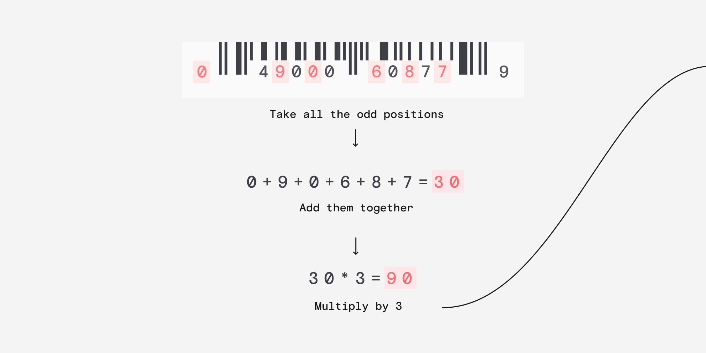
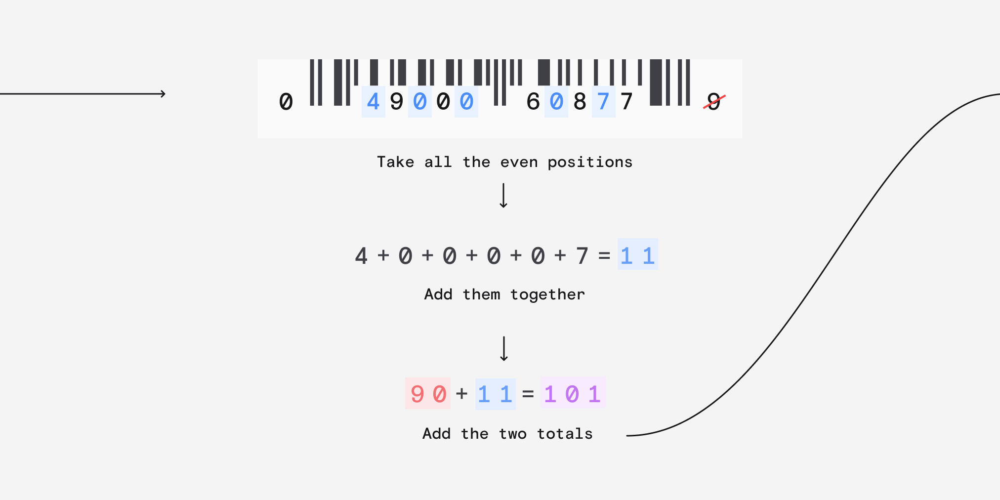
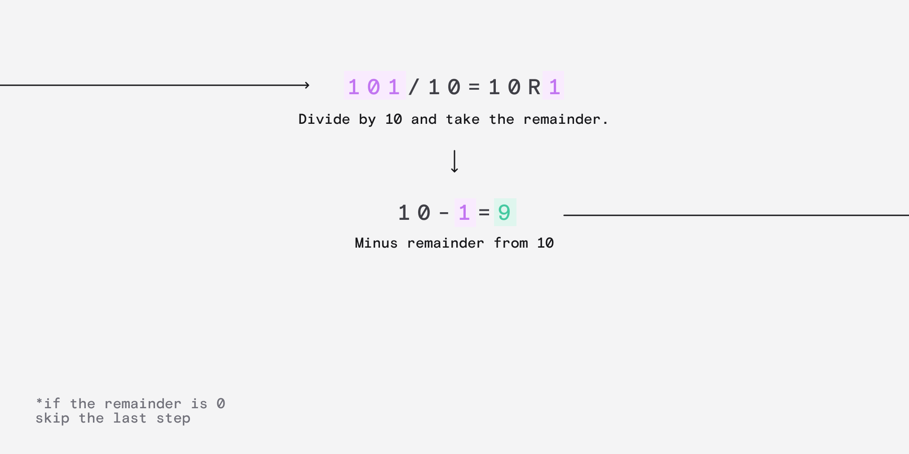
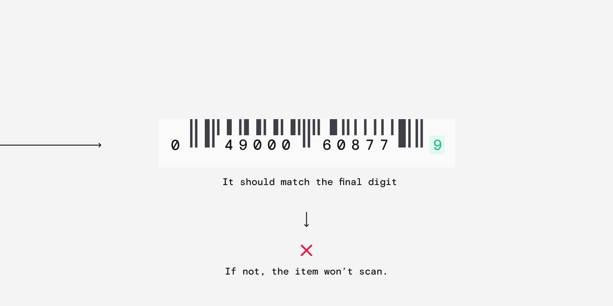

# Barcode Scanner
ทำการสร้าง algorithm ที่ทำหน้าที่ตรวจสอบว่าบาร์โค้ดรหัสนี้เป็นรหัสที่ถูกต้องหรือไม่ ด้วยการใช้ระบบดังต่อไปนี้






## ข้อกำหนดและเงื่อนไข
- **Input** (string): ตัวเลขบาร์โค้ดทั่วไปความยาว 12 ตัวอักษร
- **Output** (boolean): `True` หากเป็นบาร์โค้ดที่ถูกต้องหรือ `False` หากเป็นบาร์โค้ดที่ไม่ถูกต้อง

## ตัวอย่าง Input / Output
```text
Input
049000608779

Output
True
```
